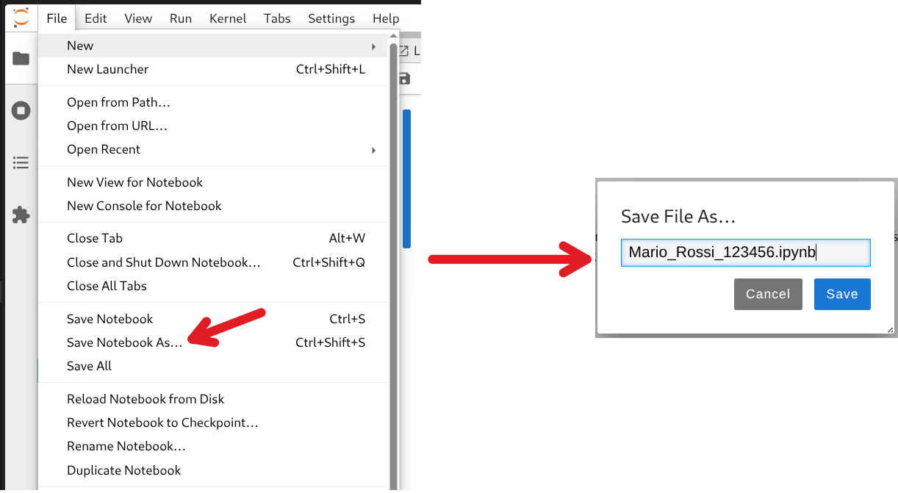

# ML_DEI_exam
Repository for the exams of the Machine Learning course.

```bash
EXAM=password singularity run /nfsd/opt/sif-images/ML_notebook_v9.sif
```

## Consegna

1. Salva il notebook dal menu: 
    - "File" → "Save Notebook As..."
    - Nominalo: "Nome_Cognome_Matricola.ipynb"
    - Premi "Save"

Vedi:


